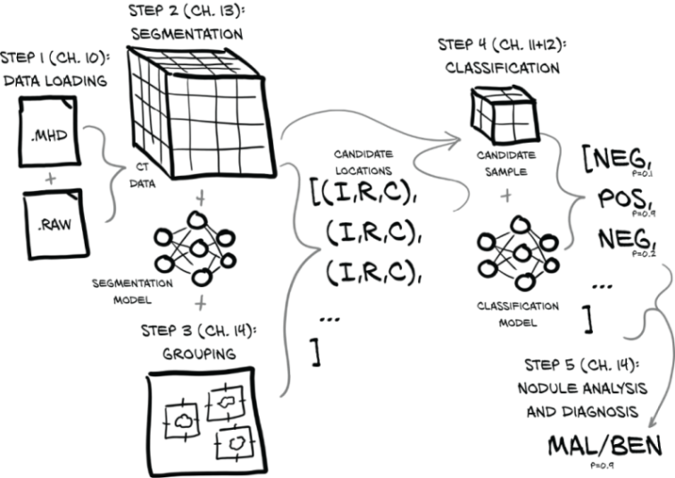

# LUNA-Challenge

LUNA (LUng Nodule Analysis) 16 - ISBI 2016 Challenge

https://luna16.grand-challenge.org/

The model is based on the book Deep Learning with PyTorch, (https://www.manning.com/books/deep-learning-with-pytorch)

## End to End Model 

### Sample CT Scan with (I,R,C) coordinates

## U-Net Architecture for Segmentation

#### Sample result from segmentation identifying a positive nodule

## Resnet model for classification

#### Data augmentation techniques for balanced dataset

### A CT segment

### ROC Curve for final classifier with last layer fine tuned

